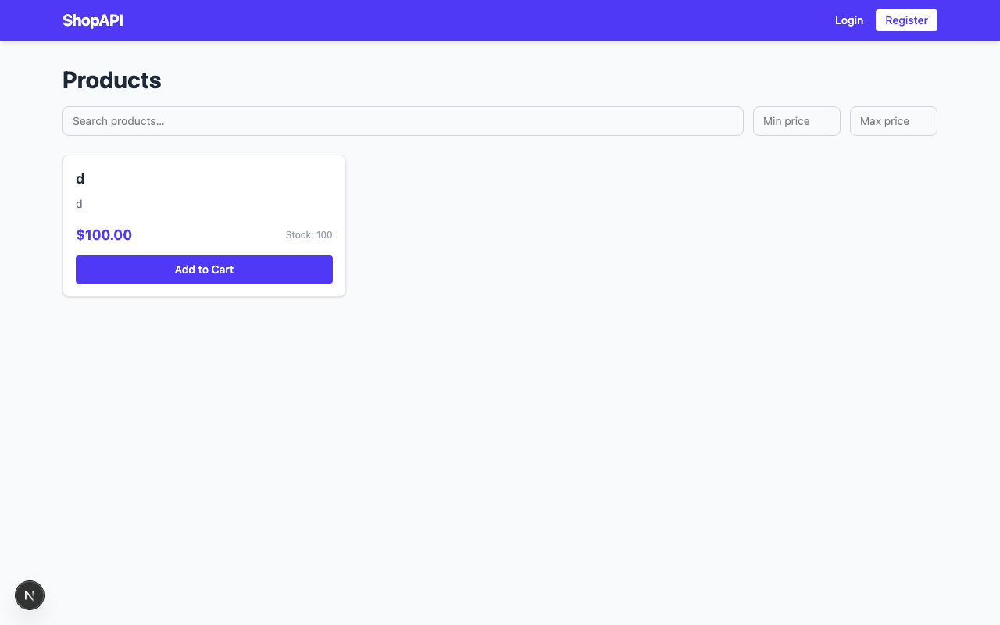
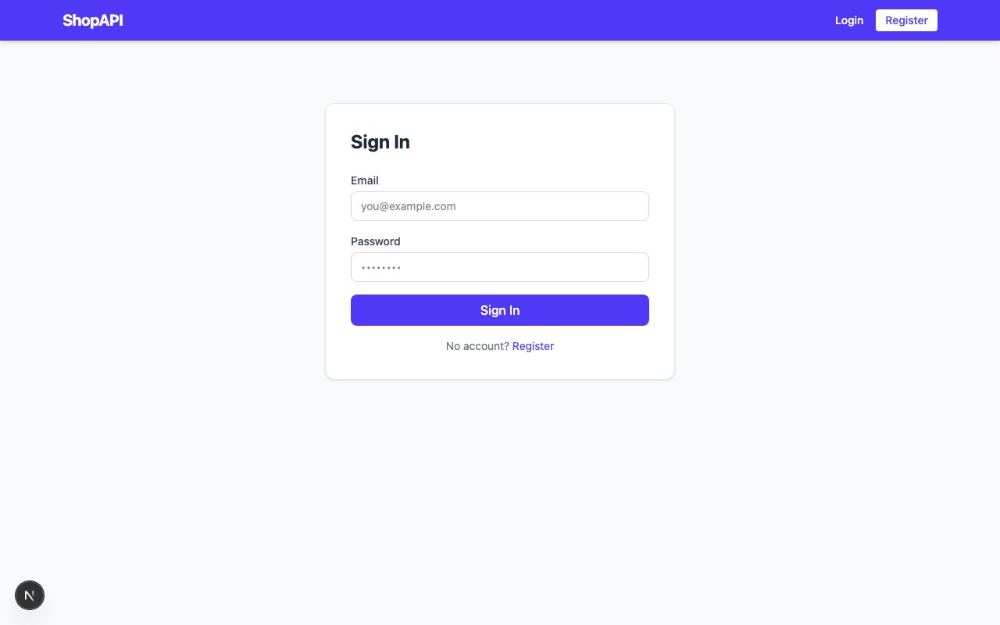
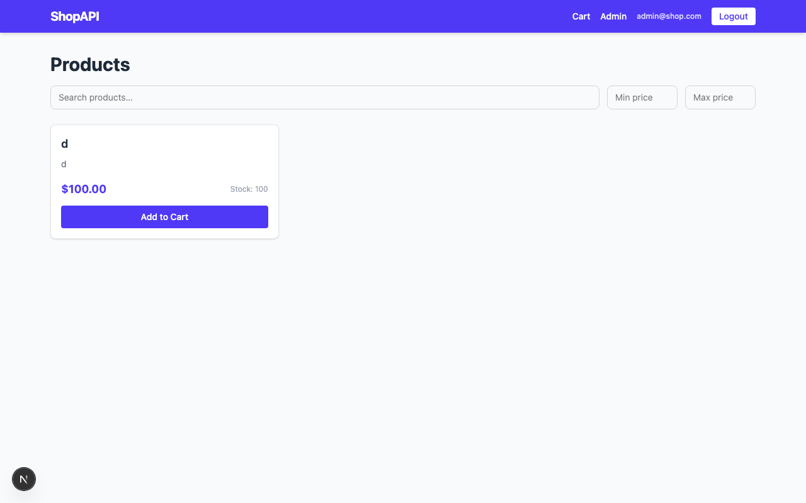
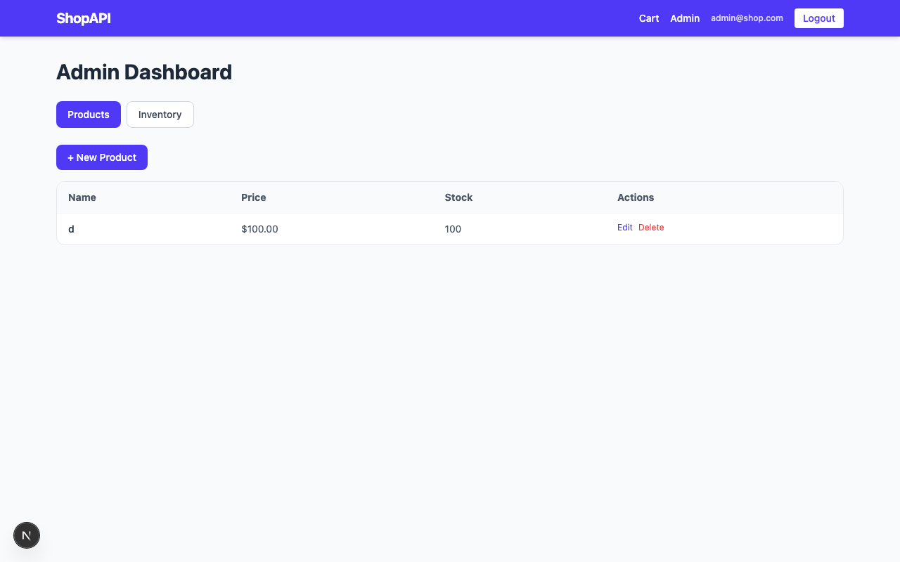
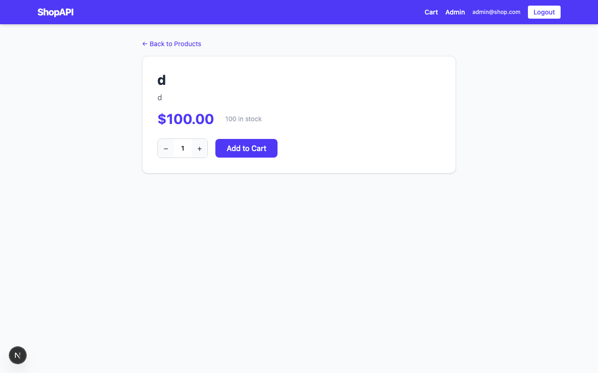
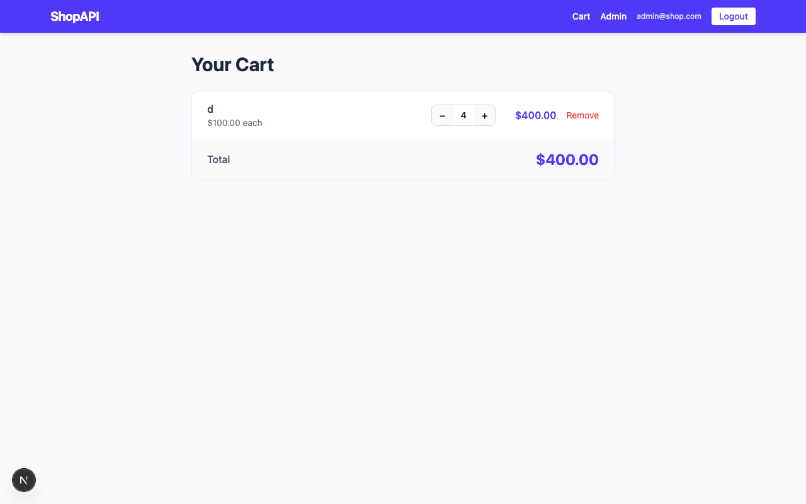

# ShopAPI

A full-stack e-commerce app split across two branches:

| Branch | Role | Port |
|--------|------|------|
| `frontend` | Next.js UI | 3000 |
| `backend` | Express REST API | 4000 |

---

## Screenshots

### 1. Home — Product Listing
Products fetched live from the Express backend API.



---

### 2. Login Page
User authentication via JWT.



---

### 3. Logged In (Admin)
Navbar shows Cart, Admin link, email, and Logout after signing in.



---

### 4. Admin Dashboard
Admins can create, edit, and delete products and manage inventory.



---

### 5. Product Detail Page
Shows price, stock count, quantity selector, and Add to Cart.



---

### 6. Cart Page
Shows items, quantity controls, subtotals, and Remove button.



---

### 7. Backend API — `GET /api/products`
Express server returns raw JSON — this is what the frontend calls.


---

### 8. Backend API — `GET /api/cart` (no token)
Protected routes return `{"error":"Unauthorized"}` without a JWT.


---

## Running locally

**Terminal 1 — Backend (Express on port 4000)**
```bash
cd ~/1/part1-backend/backend
npm install
npm run dev
```

**Terminal 2 — Frontend (Next.js on port 3000)**
```bash
cd ~/1/part1
npm install
npm run dev
```

Open `http://localhost:3000` in the browser.

---

## API Routes

| Method | Path | Auth | Description |
|--------|------|------|-------------|
| POST | `/api/auth/register` | — | Register user |
| POST | `/api/auth/login` | — | Login, returns JWT |
| GET | `/api/products` | — | List / search products |
| POST | `/api/products` | admin | Create product |
| PUT | `/api/products/:id` | admin | Update product |
| DELETE | `/api/products/:id` | admin | Delete product |
| GET | `/api/cart` | user | Get cart |
| POST | `/api/cart` | user | Add item to cart |
| PATCH | `/api/cart/:itemId` | user | Update quantity |
| DELETE | `/api/cart/:itemId` | user | Remove item |
| PATCH | `/api/inventory/:id` | admin | Update stock |

---

## Tests

```bash
npm test              # 40 unit tests (Vitest)
npm run test:e2e      # 25 end-to-end tests (Playwright)
```
