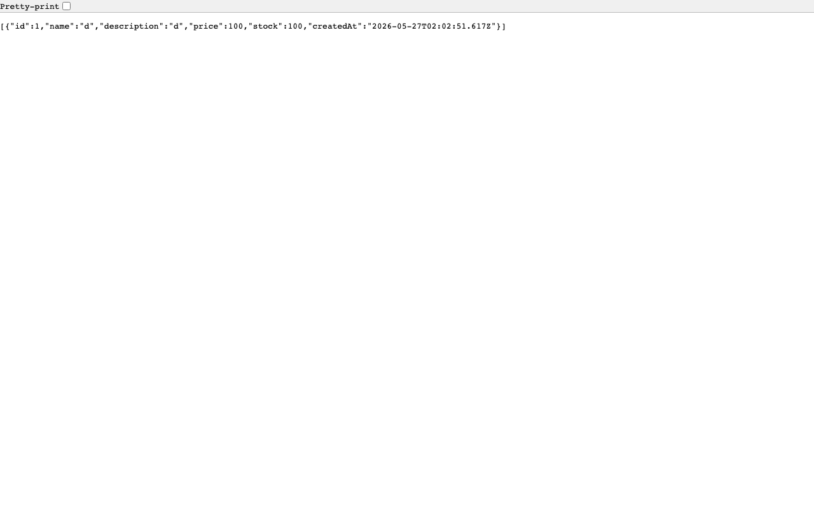

# ShopAPI

A full-stack e-commerce app split across two branches:

| Branch | Role | Port |
|--------|------|------|
| `frontend` | Next.js UI | 3000 |
| `backend` | Express REST API | 4000 |

## Screenshots

### Frontend — `http://localhost:3000`


### Backend API — `http://localhost:4000/api/products`


## Running locally

**Terminal 1 — Backend**
```bash
cd ~/1/part1-backend/backend
npm install
npm run dev        # Express on http://localhost:4000
```

**Terminal 2 — Frontend**
```bash
cd ~/1/part1
npm install
npm run dev        # Next.js on http://localhost:3000
```

## API Routes

| Method | Path | Auth | Description |
|--------|------|------|-------------|
| POST | `/api/auth/register` | — | Register user |
| POST | `/api/auth/login` | — | Login, returns JWT |
| GET | `/api/products` | — | List products |
| POST | `/api/products` | admin | Create product |
| PUT | `/api/products/:id` | admin | Update product |
| DELETE | `/api/products/:id` | admin | Delete product |
| GET | `/api/cart` | user | Get cart |
| POST | `/api/cart` | user | Add item to cart |
| PATCH | `/api/cart/:itemId` | user | Update quantity |
| DELETE | `/api/cart/:itemId` | user | Remove item |
| PATCH | `/api/inventory/:id` | admin | Update stock |

## Tests

```bash
npm test           # 40 unit tests
npm run test:e2e   # 25 end-to-end tests
```
