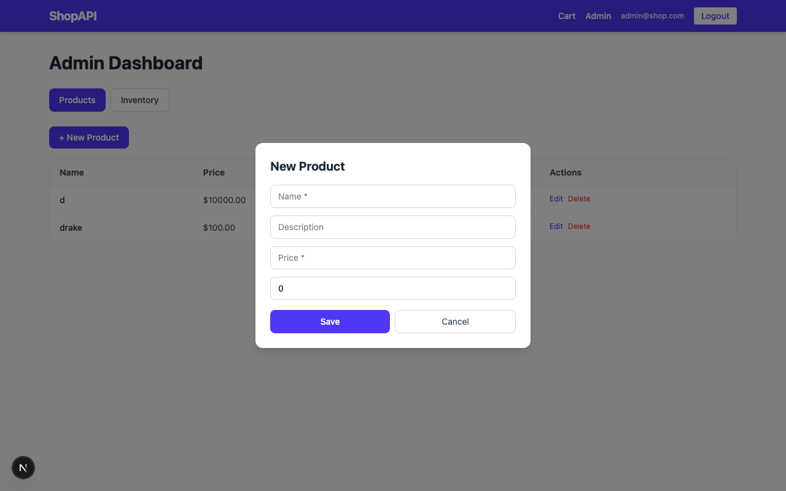
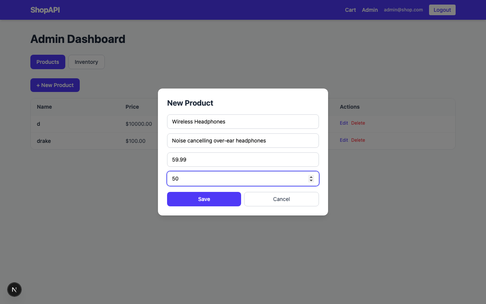
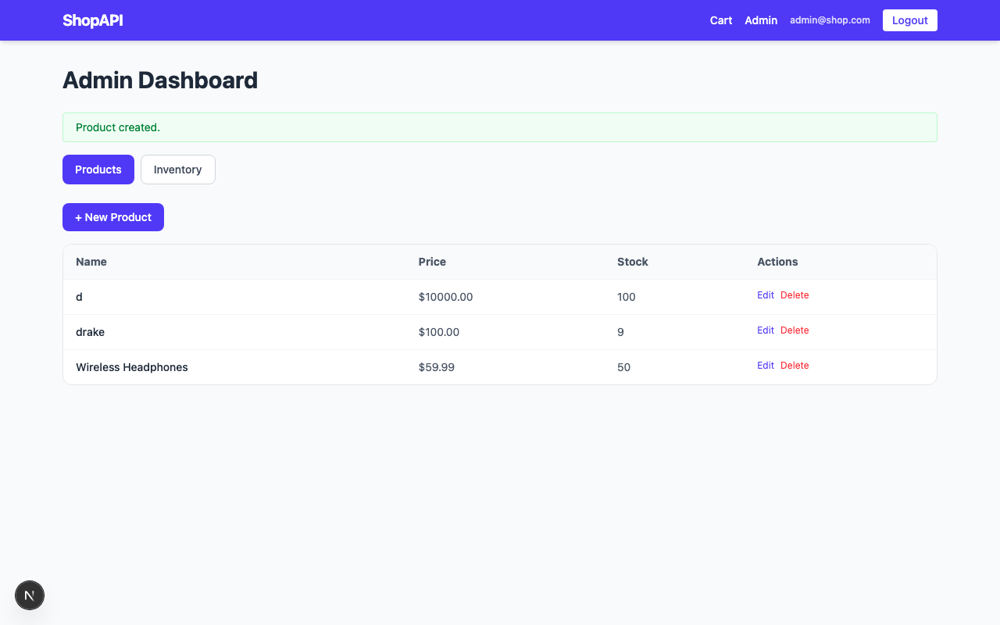
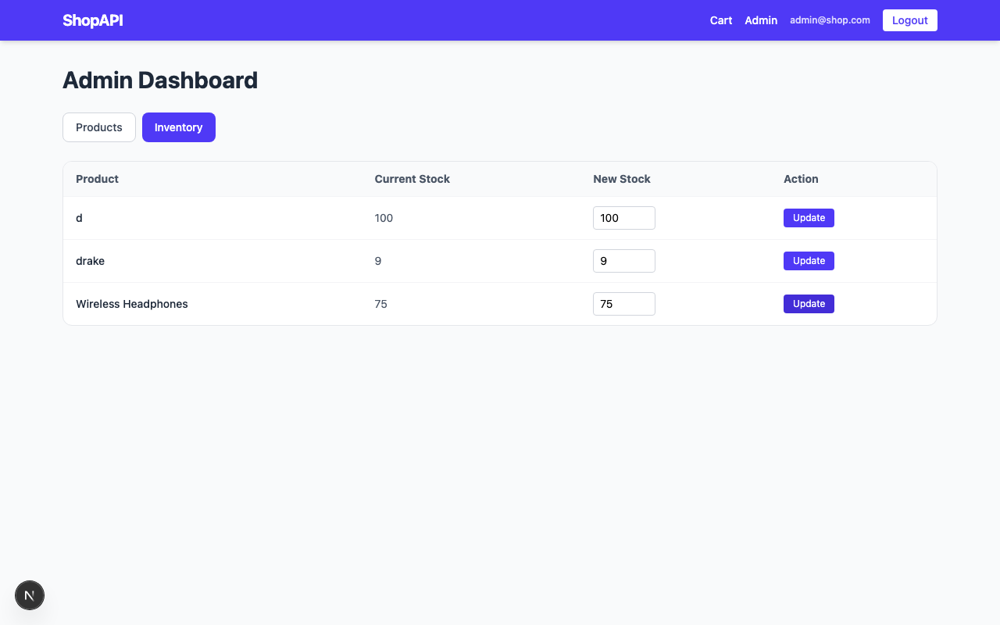
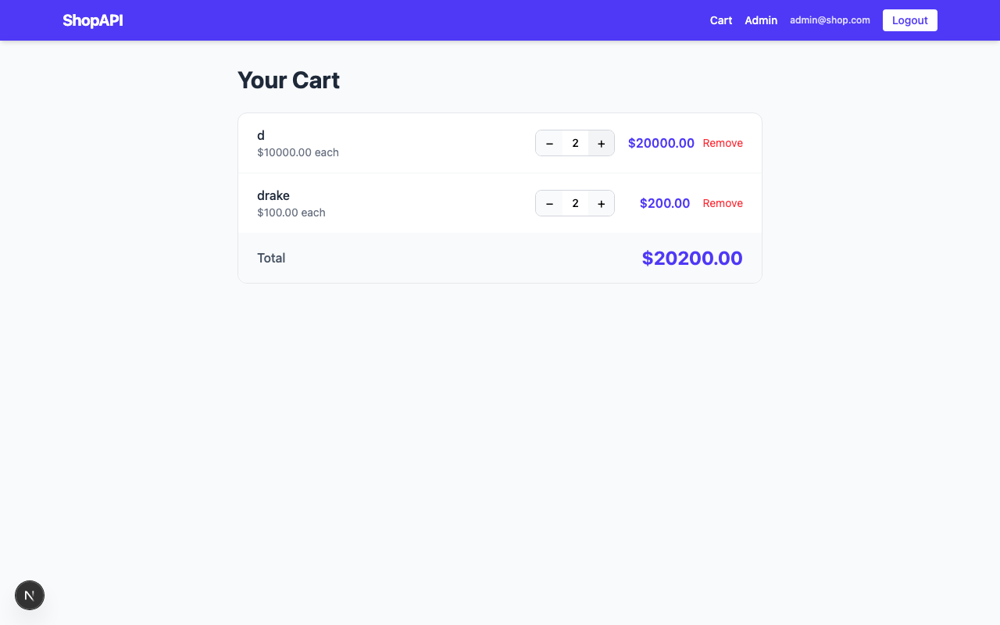
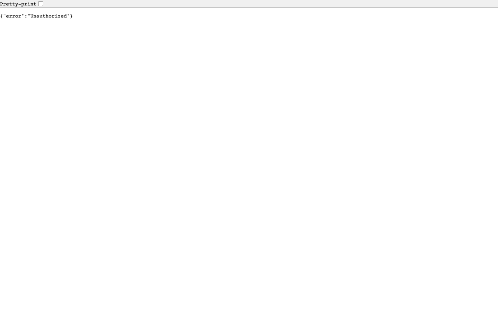

# ShopAPI

A full-stack e-commerce app split across two branches:

| Branch | Role | Port |
|--------|------|------|
| `frontend` | Next.js UI | 3000 |
| `backend` | Express REST API | 4000 |

---

## Screenshots

### 1. Home — Product Listing


### 2. Login Page


### 3. Logged In as Admin
Navbar shows Cart, Admin, email, and Logout after signing in.


### 4. Admin Dashboard — Product List
Admin can see all products with Edit and Delete actions.


### 5. Create New Product — Empty Form
Admin clicks "+ New Product" to open the form modal.



### 6. Create New Product — Filled
Form filled with name, description, price, and stock.



### 7. Product Created — Success
"Product created." confirmation and new product appears in the list.



### 8. Inventory Tab — Update Stock
Admin updates the stock number for any product and clicks Update.



### 9. Product Detail Page
Shows price, stock, quantity selector, and Add to Cart button.


### 10. Cart — Multiple Items
Cart shows all items, per-item subtotals, and a running total.


### 11. Cart — Quantity Updated
Clicking + increases quantity and total updates live.



### 12. Backend API — `GET /api/products`
Express server returns raw JSON — what the frontend calls.


### 13. Backend API — `GET /api/cart` (no token → 401)
Protected routes return `{"error":"Unauthorized"}` without a JWT.



---

## Running locally

**Terminal 1 — Backend (Express on port 4000)**
```bash
cd ~/1/part1-backend/backend
npm install
npm run dev
```

**Terminal 2 — Frontend (Next.js on port 3000)**
```bash
cd ~/1/part1
npm install
npm run dev
```

Open `http://localhost:3000` in the browser.

---

## API Routes

| Method | Path | Auth | Description |
|--------|------|------|-------------|
| POST | `/api/auth/register` | — | Register user |
| POST | `/api/auth/login` | — | Login, returns JWT |
| GET | `/api/products` | — | List / search products |
| POST | `/api/products` | admin | Create product |
| PUT | `/api/products/:id` | admin | Update product |
| DELETE | `/api/products/:id` | admin | Delete product |
| GET | `/api/cart` | user | Get cart |
| POST | `/api/cart` | user | Add item to cart |
| PATCH | `/api/cart/:itemId` | user | Update quantity |
| DELETE | `/api/cart/:itemId` | user | Remove item |
| PATCH | `/api/inventory/:id` | admin | Update stock |

---

## Tests

```bash
npm test              # 40 unit tests (Vitest)
npm run test:e2e      # 25 end-to-end tests (Playwright)
```
