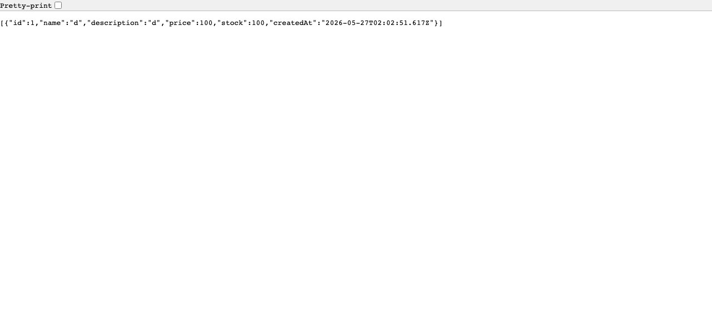
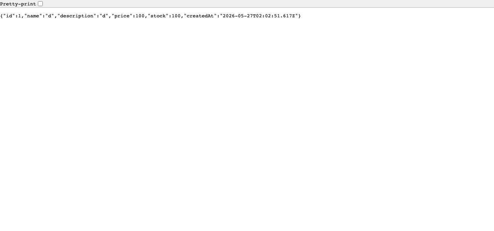
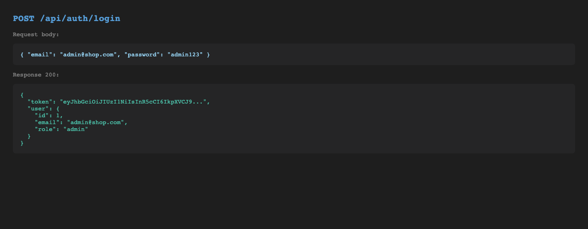
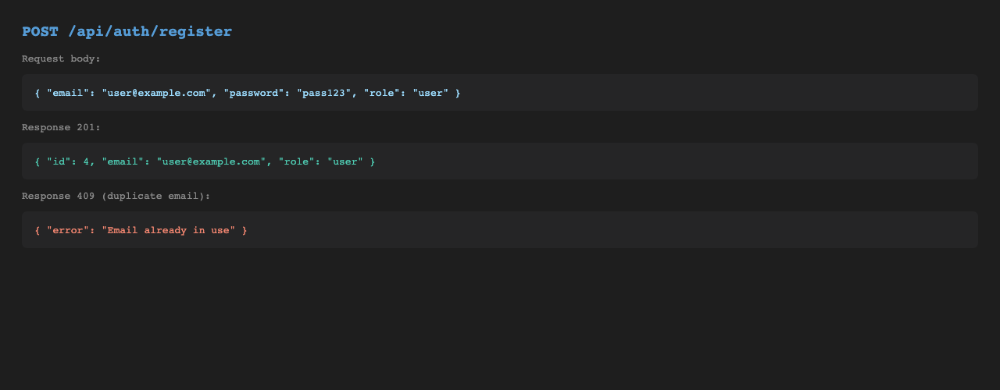
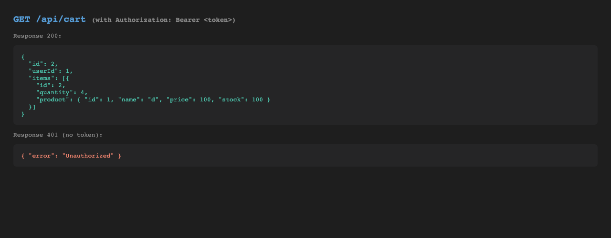

# Backend — Express API Server

Runs on `http://localhost:4000`. All routes are under `/api/`.

## Start

```bash
npm install
npm run dev
```

---

## API Screenshots

### GET /api/products — Public
Returns all products. No auth required.



---

### GET /api/products/:id — Public
Returns a single product by ID.



---

### POST /api/auth/login — Public
Returns a JWT token + user info on success.



---

### POST /api/auth/register — Public
Creates a new user. Returns 201 on success, 409 if email taken.



---

### GET /api/cart — Protected (JWT required)
Returns cart with items when token is valid. Returns 401 without token.



---

### GET /api/cart — No token (401)


---

## All Endpoints

| Method | Path | Auth | Description |
|--------|------|------|-------------|
| POST | `/api/auth/register` | — | Register user |
| POST | `/api/auth/login` | — | Login → JWT |
| GET | `/api/products` | — | List products |
| GET | `/api/products/:id` | — | Get one product |
| POST | `/api/products` | admin | Create product |
| PUT | `/api/products/:id` | admin | Update product |
| DELETE | `/api/products/:id` | admin | Delete product |
| GET | `/api/cart` | user | Get cart |
| POST | `/api/cart` | user | Add to cart |
| PATCH | `/api/cart/:itemId` | user | Update quantity |
| DELETE | `/api/cart/:itemId` | user | Remove item |
| PATCH | `/api/inventory/:id` | admin | Update stock |
